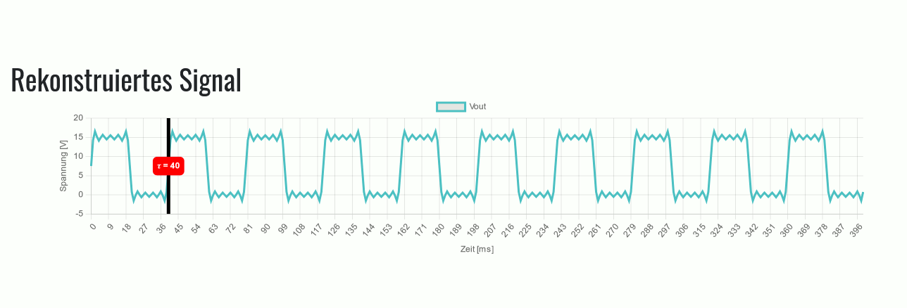

# Project Fourier Analysis

Based on [digital-regulator-and-dac-js](https://gitlab.com/2tefan/digital-regulator-js)

This repo contains a little school project in which two signals (a rectangle & a random one) are fourier transformed and then reconstructed again. All steps are visualized with ChartJS :innocent:

